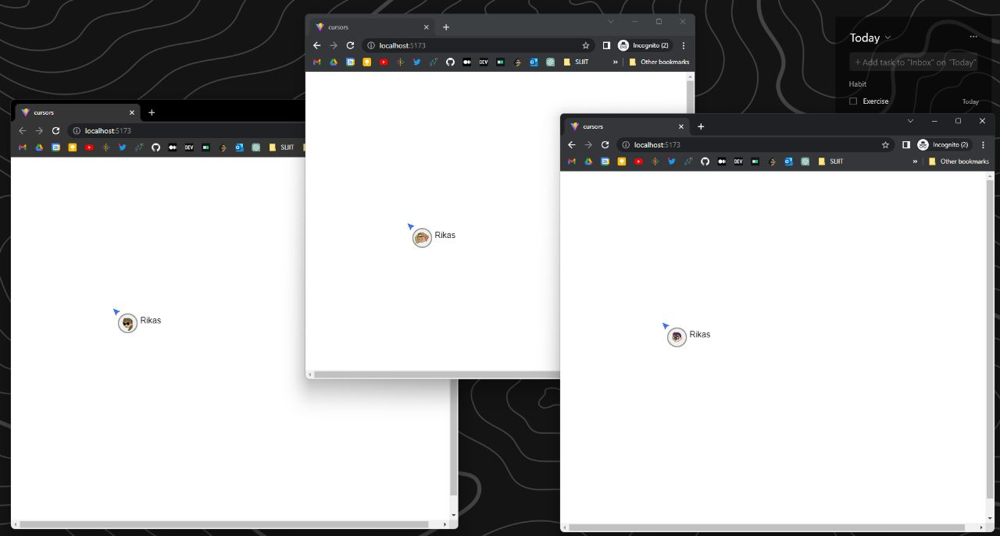

# A full-stack application that can detect user's cursors in real time

```Vite, React, Typescript, socket.io, Redux Toolkit, Recharts, Node Js, Express Js ```



```bash
    Canvas white page
    User gets into the system, ask his/her username and save it in the system
    Redux for storing data in the system
    All the users who are viewing the screen must be able to see the cursor position of other users
    Socket.io to achieve the real time progress of cursor position
 ```